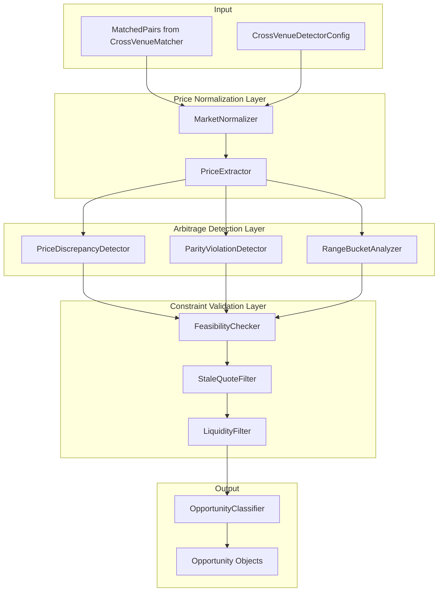

# Design Document: Cross-Venue Arbitrage Detector

## Overview

This design specifies a Cross-Venue Arbitrage Detector that identifies arbitrage opportunities between matched Polymarket and Kalshi prediction markets. The detector consumes matched market pairs from the `CrossVenueMatcher` pipeline and analyzes them for three types of arbitrage:

1. **Price Discrepancy**: Same event priced differently across venues
2. **Cross-Venue Parity Violation**: Buying YES on one venue + NO on another costs less than $1.00
3. **Range Bucket Arbitrage**: Polymarket range markets vs equivalent Kalshi bucket contracts

Key design constraints:
- **NO SHORT SELLING on Polymarket**: All strategies must be BUY-only or use Kalshi for shorts
- **Price Normalization**: Polymarket uses [0.0-1.0] probabilities, Kalshi uses cents (0-100)
- **Fee Awareness**: Kalshi 7bps, Polymarket 10bps per side
- **Stale Quote Filtering**: Configurable staleness threshold (default 5 minutes)
- **Liquidity Filtering**: Configurable minimum liquidity (default $100)

The detector integrates with the existing detector pattern in `src/predarb/detectors/` and outputs `Opportunity` objects compatible with the risk manager and broker.

## Architecture



## Components and Interfaces

### 1. CrossVenueDetectorConfig

Configuration for the cross-venue arbitrage detector.

```python
class CrossVenueDetectorConfig(BaseModel):
    """Configuration for cross-venue arbitrage detection."""
    
    enabled: bool = True
    
    # Price discrepancy detection
    min_price_diff_threshold: float = 0.02  # 2% minimum price difference
    
    # Fee configuration (basis points)
    kalshi_fee_bps: float = 7.0
    polymarket_fee_bps: float = 10.0
    
    # Slippage configuration
    slippage_bps: float = 20.0
    
    # Staleness filtering
    staleness_threshold_seconds: int = 300  # 5 minutes
    
    # Liquidity filtering
    min_liquidity_usd: float = 100.0
    
    # Range bucket detection
    bucket_sum_threshold: float = 0.02  # 2% difference threshold
```

### 2. MarketNormalizer

Converts venue-specific market formats into a unified structure.

```python
@dataclass
class NormalizedMarket:
    """Unified market representation with normalized prices."""
    market_id: str
    exchange: str  # "kalshi" or "polymarket"
    question: str
    
    # Normalized prices in [0.0-1.0] range
    yes_bid: float
    yes_ask: float
    no_bid: float
    no_ask: float
    
    # Liquidity in USD
    liquidity_usd: float
    
    # Timestamp for staleness checking
    updated_at: datetime
    
    # Original market reference
    original: Market
    
    # Tradeable flag
    is_tradeable: bool = True
    non_tradeable_reason: Optional[str] = None


class MarketNormalizer:
    """Normalizes Polymarket and Kalshi markets to unified format."""
    
    def normalize(self, market: Market) -> NormalizedMarket:
        """
        Normalize a market to unified format.
        
        Polymarket: Prices already in [0.0-1.0], extract from outcomes array
        Kalshi: Convert cents (0-100) to probability (0.0-1.0)
        """
    
    def normalize_polymarket(self, market: Market) -> NormalizedMarket:
        """Extract YES/NO prices from Polymarket outcomes array."""
    
    def normalize_kalshi(self, market: Market) -> NormalizedMarket:
        """Convert Kalshi cents to probability, derive NO = 1 - YES."""
    
    def _validate_prices(self, nm: NormalizedMarket) -> NormalizedMarket:
        """Mark market as non-tradeable if prices are invalid."""
```

### 3. PriceExtractor

Extracts bid/ask/mid prices from normalized markets.

```python
@dataclass
class ExtractedPrices:
    """Extracted price data for arbitrage calculations."""
    yes_bid: float
    yes_ask: float
    yes_mid: float
    no_bid: float
    no_ask: float
    no_mid: float


class PriceExtractor:
    """Extracts and validates prices from normalized markets."""
    
    def extract(self, market: NormalizedMarket) -> Optional[ExtractedPrices]:
        """Extract prices, return None if invalid."""
    
    def calculate_mid(self, bid: float, ask: float) -> float:
        """Calculate mid price from bid/ask."""
```

### 4. CrossVenueDetector

Main detector class that orchestrates all detection types.

```python
class CrossVenueDetector:
    """
    Detects cross-venue arbitrage opportunities.
    
    Consumes matched pairs from CrossVenueMatcher and identifies:
    - Price discrepancies
    - Cross-venue parity violations
    - Range bucket arbitrage
    """
    
    def __init__(
        self,
        config: CrossVenueDetectorConfig,
        broker_config: BrokerConfig,
    ):
        self.config = config
        self.broker_config = broker_config
        self.normalizer = MarketNormalizer()
        self.price_extractor = PriceExtractor()
        self.feasibility_checker = FeasibilityChecker()
        self.stale_filter = StaleQuoteFilter(config.staleness_threshold_seconds)
        self.liquidity_filter = LiquidityFilter(config.min_liquidity_usd)
    
    def detect(
        self,
        matched_pairs: List[Tuple[Market, Market, float]]
    ) -> List[Opportunity]:
        """
        Detect arbitrage opportunities from matched pairs.
        
        Args:
            matched_pairs: List of (kalshi_market, poly_market, similarity_score)
        
        Returns:
            List of Opportunity objects
        """
    
    def _detect_price_discrepancy(
        self,
        kalshi: NormalizedMarket,
        poly: NormalizedMarket,
    ) -> Optional[Opportunity]:
        """Detect price discrepancy between venues."""
    
    def _detect_parity_violation(
        self,
        kalshi: NormalizedMarket,
        poly: NormalizedMarket,
    ) -> Optional[Opportunity]:
        """Detect cross-venue parity violation."""
    
    def _calculate_fees(
        self,
        kalshi_amount: float,
        poly_amount: float,
    ) -> Tuple[float, float]:
        """Calculate fees for both venues."""
```

### 5. FeasibilityChecker

Validates opportunities against venue constraints.

```python
@dataclass
class FeasibilityResult:
    """Result of feasibility check."""
    is_feasible: bool
    reason: Optional[str] = None
    restructured_actions: Optional[List[TradeAction]] = None


class FeasibilityChecker:
    """
    Validates opportunities against venue constraints.
    
    Key constraint: NO SHORT SELLING on Polymarket.
    """
    
    def check(
        self,
        opportunity: Opportunity,
        inventory: Optional[Dict[str, float]] = None,
    ) -> FeasibilityResult:
        """
        Check if opportunity is feasible given venue constraints.
        
        Args:
            opportunity: The opportunity to check
            inventory: Optional current inventory for Polymarket sells
        
        Returns:
            FeasibilityResult with feasibility status and optional restructured actions
        """
    
    def _has_polymarket_sell(self, actions: List[TradeAction]) -> bool:
        """Check if any action is a Polymarket SELL."""
    
    def _restructure_as_buy_only(
        self,
        opportunity: Opportunity,
    ) -> Optional[List[TradeAction]]:
        """
        Attempt to restructure opportunity as BUY-only.
        
        When Polymarket YES is overpriced:
          Original: SELL Polymarket YES
          Restructured: BUY Polymarket NO (equivalent exposure)
        """
    
    def _generate_strategy(
        self,
        kalshi: NormalizedMarket,
        poly: NormalizedMarket,
        kalshi_cheaper: bool,
    ) -> List[TradeAction]:
        """
        Generate feasible strategy based on price comparison.
        
        If Polymarket YES overpriced (kalshi_cheaper=True):
          BUY Kalshi YES + BUY Polymarket NO
        
        If Kalshi YES overpriced (kalshi_cheaper=False):
          BUY Polymarket YES + SELL Kalshi YES (Kalshi supports shorting)
        """
```

### 6. StaleQuoteFilter

Filters opportunities based on quote freshness.

```python
@dataclass
class StalenessResult:
    """Result of staleness check."""
    kalshi_age_seconds: float
    poly_age_seconds: float
    kalshi_stale: bool
    poly_stale: bool
    should_discard: bool  # True if both stale
    flag: Optional[str] = None  # "STALE" if one is stale


class StaleQuoteFilter:
    """Filters opportunities based on quote staleness."""
    
    def __init__(self, threshold_seconds: int = 300):
        self.threshold_seconds = threshold_seconds
    
    def check(
        self,
        kalshi: NormalizedMarket,
        poly: NormalizedMarket,
        now: Optional[datetime] = None,
    ) -> StalenessResult:
        """
        Check staleness of both markets.
        
        Returns:
            StalenessResult with ages and staleness flags
        """
    
    def _calculate_age(
        self,
        updated_at: Optional[datetime],
        now: datetime,
    ) -> float:
        """Calculate age in seconds."""
```

### 7. LiquidityFilter

Filters opportunities based on available liquidity.

```python
@dataclass
class LiquidityResult:
    """Result of liquidity check."""
    kalshi_liquidity: float
    poly_liquidity: float
    kalshi_low: bool
    poly_low: bool
    should_discard: bool  # True if both below minimum
    max_executable_size: float
    flag: Optional[str] = None  # "LOW_LIQUIDITY" if one is low


class LiquidityFilter:
    """Filters opportunities based on liquidity."""
    
    def __init__(self, min_liquidity_usd: float = 100.0):
        self.min_liquidity_usd = min_liquidity_usd
    
    def check(
        self,
        kalshi: NormalizedMarket,
        poly: NormalizedMarket,
    ) -> LiquidityResult:
        """
        Check liquidity of both markets.
        
        Returns:
            LiquidityResult with liquidity values and flags
        """
    
    def calculate_max_size(
        self,
        kalshi_liquidity: float,
        poly_liquidity: float,
    ) -> float:
        """Calculate maximum executable size based on minimum liquidity."""
```

### 8. RangeBucketAnalyzer

Detects arbitrage between range markets and bucket contracts.

```python
@dataclass
class BucketMapping:
    """Mapping between Polymarket range and Kalshi buckets."""
    polymarket_market: NormalizedMarket
    kalshi_buckets: List[NormalizedMarket]
    range_start: float
    range_end: float


class RangeBucketAnalyzer:
    """
    Analyzes range market vs bucket contract arbitrage.
    
    Polymarket range markets (e.g., "BTC between $90k-$100k")
    map to multiple Kalshi bucket contracts.
    """
    
    def __init__(self, config: CrossVenueDetectorConfig):
        self.config = config
    
    def identify_bucket_mapping(
        self,
        poly_market: NormalizedMarket,
        kalshi_markets: List[NormalizedMarket],
    ) -> Optional[BucketMapping]:
        """Identify if Polymarket range maps to Kalshi buckets."""
    
    def detect_bucket_arbitrage(
        self,
        mapping: BucketMapping,
    ) -> Optional[Opportunity]:
        """
        Detect arbitrage between range and buckets.
        
        Compares sum of Kalshi bucket YES prices to Polymarket outcome price.
        """
    
    def _calculate_bucket_sum(
        self,
        buckets: List[NormalizedMarket],
    ) -> float:
        """Calculate sum of bucket YES prices."""
    
    def _generate_bucket_actions(
        self,
        mapping: BucketMapping,
        kalshi_underpriced: bool,
    ) -> List[TradeAction]:
        """
        Generate trade actions for bucket arbitrage.
        
        If Kalshi underpriced: BUY all Kalshi buckets
        If Kalshi overpriced: BUY Polymarket + SELL Kalshi buckets
        """
```

### 9. OpportunityClassifier

Classifies and formats detected opportunities.

```python
class OpportunityClassifier:
    """Classifies and formats arbitrage opportunities."""
    
    OPPORTUNITY_TYPES = {
        "price_discrepancy": "CROSS_VENUE_PRICE",
        "parity_violation": "CROSS_VENUE_PARITY",
        "range_bucket": "RANGE_BUCKET",
    }
    
    def classify(
        self,
        detection_type: str,
        kalshi: NormalizedMarket,
        poly: NormalizedMarket,
        actions: List[TradeAction],
        net_edge: float,
        metadata: Dict[str, Any],
        staleness: StalenessResult,
        liquidity: LiquidityResult,
    ) -> Opportunity:
        """
        Create classified Opportunity object.
        
        Includes:
        - Correct opportunity type
        - Both market IDs
        - Complete TradeActions
        - Metadata with venue-specific details
        - Staleness and liquidity flags
        """
    
    def _build_metadata(
        self,
        kalshi: NormalizedMarket,
        poly: NormalizedMarket,
        staleness: StalenessResult,
        liquidity: LiquidityResult,
        extra: Dict[str, Any],
    ) -> Dict[str, Any]:
        """Build complete metadata dictionary."""
```

## Data Models

### NormalizedMarket

```python
@dataclass
class NormalizedMarket:
    """Unified market representation."""
    market_id: str
    exchange: str  # "kalshi" or "polymarket"
    question: str
    
    # Normalized prices [0.0-1.0]
    yes_bid: float
    yes_ask: float
    no_bid: float
    no_ask: float
    
    # Liquidity
    liquidity_usd: float
    
    # Timestamp
    updated_at: datetime
    
    # Original reference
    original: Market
    
    # Validity
    is_tradeable: bool = True
    non_tradeable_reason: Optional[str] = None
```

### Extended Opportunity Metadata

The existing `Opportunity` model is extended with cross-venue specific metadata:

```python
# Opportunity.metadata for CROSS_VENUE_PRICE
{
    "kalshi_price": 0.45,
    "polymarket_price": 0.52,
    "price_diff": 0.07,
    "fees_kalshi": 0.000315,  # 7bps
    "fees_polymarket": 0.00104,  # 10bps * 2 sides
    "kalshi_age_seconds": 45.2,
    "poly_age_seconds": 12.8,
    "kalshi_liquidity": 5000.0,
    "poly_liquidity": 3200.0,
    "max_executable_size": 3200.0,
    "flags": ["STALE"],  # or ["LOW_LIQUIDITY"] or []
}

# Opportunity.metadata for CROSS_VENUE_PARITY
{
    "kalshi_yes_ask": 0.42,
    "poly_no_ask": 0.55,
    "total_cost": 0.97,
    "guaranteed_profit": 0.03,
    "fees_total": 0.00134,
    # ... staleness and liquidity fields
}

# Opportunity.metadata for RANGE_BUCKET
{
    "polymarket_range_price": 0.35,
    "kalshi_bucket_sum": 0.30,
    "bucket_count": 3,
    "bucket_ids": ["bucket1", "bucket2", "bucket3"],
    "price_diff": 0.05,
    # ... staleness and liquidity fields
}
```


## Correctness Properties

*A property is a characteristic or behavior that should hold true across all valid executions of a system—essentially, a formal statement about what the system should do. Properties serve as the bridge between human-readable specifications and machine-verifiable correctness guarantees.*

### Property 1: Price Normalization Range Invariant

*For any* valid Polymarket or Kalshi market, after normalization, all price fields (yes_bid, yes_ask, no_bid, no_ask) should be within the [0.0, 1.0] range.

**Validates: Requirements 1.1, 1.2, 1.5**

### Property 2: Kalshi NO Price Derivation

*For any* Kalshi market with YES prices, the normalized NO prices should satisfy: no_bid = 1.0 - yes_ask and no_ask = 1.0 - yes_bid (bid/ask inversion for complement).

**Validates: Requirements 1.2**

### Property 3: Bid/Ask Structure Completeness

*For any* normalized market marked as tradeable, the best_bid and best_ask dictionaries should contain entries for both "YES" and "NO" outcomes.

**Validates: Requirements 1.3**

### Property 4: Invalid Price Exclusion

*For any* market with missing prices, NaN values, or prices outside [0.0, 1.0], the normalizer should mark it as non-tradeable and exclude it from detection.

**Validates: Requirements 1.4**

### Property 5: Price Discrepancy Detection Threshold

*For any* matched pair where |kalshi_yes_mid - poly_yes_mid| > threshold, the detector should produce an opportunity. *For any* pair where the difference is <= threshold, no opportunity should be produced.

**Validates: Requirements 2.2**

### Property 6: Net Edge Fee Calculation

*For any* detected price discrepancy opportunity, net_edge should equal gross_edge minus (kalshi_fees + polymarket_fees + slippage), where kalshi_fees = amount * 7bps and polymarket_fees = amount * 10bps * 2.

**Validates: Requirements 2.3, 6.5**

### Property 7: Trade Direction Correctness

*For any* price discrepancy where kalshi_price < poly_price, the actions should specify BUY on Kalshi and the appropriate action on Polymarket. *For any* discrepancy where poly_price < kalshi_price, the actions should specify BUY on Polymarket.

**Validates: Requirements 2.4**

### Property 8: Non-Positive Edge Filtering

*For any* opportunity where net_edge <= 0 after fee calculation, the detector should discard the opportunity and not include it in results.

**Validates: Requirements 2.5**

### Property 9: Polymarket Short-Selling Constraint

*For any* opportunity, if any TradeAction specifies side="SELL" and the market_id belongs to Polymarket, the opportunity should either be restructured to BUY-only or marked as infeasible.

**Validates: Requirements 3.1, 3.5**

### Property 10: Polymarket Overpriced Strategy

*For any* matched pair where Polymarket YES is overpriced relative to Kalshi YES, the generated strategy should be: BUY Kalshi YES + BUY Polymarket NO.

**Validates: Requirements 3.3**

### Property 11: Kalshi Overpriced Strategy

*For any* matched pair where Kalshi YES is overpriced relative to Polymarket YES, the generated strategy should be: BUY Polymarket YES + SELL Kalshi YES.

**Validates: Requirements 3.4**

### Property 12: Cross-Venue Parity Violation Detection

*For any* matched pair where (venue_A_yes_ask + venue_B_no_ask) < 1.0 - total_fees, the detector should produce a CROSS_VENUE_PARITY opportunity with guaranteed_profit = 1.0 - total_cost - total_fees.

**Validates: Requirements 4.2, 4.3, 4.4**

### Property 13: Parity Trade Actions Completeness

*For any* CROSS_VENUE_PARITY opportunity, the actions list should contain exactly two TradeActions: one BUY on each venue, with appropriate outcome assignments (YES on one, NO on the other).

**Validates: Requirements 4.5**

### Property 14: Bucket Sum Arbitrage Detection

*For any* range market mapping where |sum(kalshi_bucket_yes_prices) - poly_range_price| > threshold, the detector should produce a RANGE_BUCKET opportunity.

**Validates: Requirements 5.2**

### Property 15: Bucket Trade Multi-Leg Fees

*For any* RANGE_BUCKET opportunity, net_edge should account for fees on all legs: sum of Kalshi fees for each bucket plus Polymarket fees.

**Validates: Requirements 5.5**

### Property 16: Opportunity Type Classification

*For any* opportunity returned by the detector, the type field should be one of: "CROSS_VENUE_PRICE", "CROSS_VENUE_PARITY", or "RANGE_BUCKET".

**Validates: Requirements 6.1**

### Property 17: Market IDs Completeness

*For any* cross-venue opportunity, the market_ids list should contain exactly two IDs: one from Kalshi and one from Polymarket.

**Validates: Requirements 6.2**

### Property 18: TradeAction Field Completeness

*For any* TradeAction in an opportunity, all required fields should be populated: market_id (non-empty), outcome_id (non-empty), side ("BUY" or "SELL"), amount (> 0), and limit_price (in [0.0, 1.0]).

**Validates: Requirements 6.3**

### Property 19: Metadata Completeness

*For any* opportunity, the metadata dictionary should contain: kalshi_price, polymarket_price, price_diff, fees_kalshi, fees_polymarket, kalshi_age_seconds, poly_age_seconds, kalshi_liquidity, poly_liquidity.

**Validates: Requirements 6.4, 7.2, 8.2**

### Property 20: Staleness Threshold Filtering

*For any* matched pair where one market's updated_at is older than staleness_threshold, the opportunity should be flagged with "STALE" in metadata.flags. *For any* pair where both markets are stale, the opportunity should be discarded.

**Validates: Requirements 7.1, 7.3, 7.4**

### Property 21: Liquidity Threshold Filtering

*For any* matched pair where one market's liquidity is below min_liquidity_usd, the opportunity should be flagged with "LOW_LIQUIDITY". *For any* pair where both markets are below minimum, the opportunity should be discarded.

**Validates: Requirements 8.1, 8.4**

### Property 22: Maximum Executable Size Calculation

*For any* opportunity, max_executable_size in metadata should equal min(kalshi_liquidity, poly_liquidity).

**Validates: Requirements 8.3**

### Property 23: Trade Amount Liquidity Constraint

*For any* TradeAction in an opportunity, the amount should not exceed the max_executable_size calculated from available liquidity.

**Validates: Requirements 8.5**

## Error Handling

### Normalization Errors

| Error Type | Cause | Handling |
|------------|-------|----------|
| `missing_prices` | Market has no price data | Mark non-tradeable, exclude from detection |
| `invalid_price_range` | Price outside [0.0, 1.0] | Mark non-tradeable, log WARNING |
| `missing_outcomes` | Market has no YES/NO outcomes | Mark non-tradeable, exclude |
| `nan_price` | Price is NaN | Mark non-tradeable, log WARNING |

### Detection Errors

| Error Type | Cause | Handling |
|------------|-------|----------|
| `normalization_failed` | One or both markets failed normalization | Skip pair, log DEBUG |
| `missing_timestamp` | Market has no updated_at | Treat as stale, flag opportunity |
| `negative_edge` | Fees exceed gross edge | Discard opportunity silently |

### Feasibility Errors

| Error Type | Cause | Handling |
|------------|-------|----------|
| `polymarket_short_required` | Strategy requires Polymarket short | Attempt restructure, mark infeasible if fails |
| `restructure_failed` | Cannot convert to BUY-only strategy | Mark opportunity as infeasible |

### Graceful Degradation

- If timestamp is missing, treat market as stale (conservative)
- If liquidity is missing or zero, use configured minimum as fallback
- If fee calculation fails, use maximum expected fees (conservative)

## Testing Strategy

### Property-Based Testing

Use `hypothesis` library with minimum 100 iterations per property test.

**Test Configuration:**
```python
from hypothesis import given, settings, strategies as st

@settings(max_examples=100)
@given(...)
def test_property_name():
    # Feature: cross-venue-arbitrage-detector, Property N: property_text
    ...
```

**Generator Strategies:**

1. **Valid Normalized Markets**: Generate markets with prices in [0.0, 1.0]
   ```python
   @st.composite
   def normalized_market(draw, exchange: str):
       yes_bid = draw(st.floats(0.01, 0.99))
       yes_ask = draw(st.floats(yes_bid, min(yes_bid + 0.1, 0.99)))
       # NO prices derived or independent based on exchange
       ...
   ```

2. **Matched Pairs with Controlled Price Diff**: Generate pairs with specific price differences
   ```python
   @st.composite
   def matched_pair_with_diff(draw, min_diff: float, max_diff: float):
       kalshi = draw(normalized_market("kalshi"))
       diff = draw(st.floats(min_diff, max_diff))
       poly_price = kalshi.yes_mid + diff
       ...
   ```

3. **Parity Violation Pairs**: Generate pairs where YES + NO < 1.0
   ```python
   @st.composite
   def parity_violation_pair(draw):
       total_cost = draw(st.floats(0.90, 0.98))  # Guaranteed profit
       kalshi_yes = draw(st.floats(0.1, total_cost - 0.1))
       poly_no = total_cost - kalshi_yes
       ...
   ```

4. **Stale/Fresh Market Pairs**: Generate pairs with controlled timestamps
   ```python
   @st.composite
   def market_pair_with_staleness(draw, kalshi_stale: bool, poly_stale: bool):
       now = datetime.utcnow()
       threshold = 300  # 5 minutes
       kalshi_age = draw(st.integers(threshold + 1, threshold + 600)) if kalshi_stale else draw(st.integers(0, threshold - 1))
       ...
   ```

### Unit Tests

Unit tests for specific examples and edge cases:

1. **Normalization Examples**
   - Polymarket market with outcomes array → correct YES/NO extraction
   - Kalshi market with 45 cents → 0.45 probability
   - Market with missing prices → marked non-tradeable

2. **Price Discrepancy Examples**
   - Kalshi 0.45, Poly 0.52 (7% diff) → opportunity detected
   - Kalshi 0.45, Poly 0.46 (1% diff) → no opportunity (below threshold)
   - Edge case: exactly at threshold

3. **Feasibility Examples**
   - Poly YES overpriced → BUY Kalshi YES + BUY Poly NO
   - Kalshi YES overpriced → BUY Poly YES + SELL Kalshi YES
   - Attempted Poly SELL → restructured or rejected

4. **Parity Violation Examples**
   - Kalshi YES 0.42 + Poly NO 0.55 = 0.97 → 3% guaranteed profit
   - Kalshi YES 0.50 + Poly NO 0.52 = 1.02 → no opportunity

5. **Staleness Examples**
   - One market 6 minutes old → flagged STALE
   - Both markets 6 minutes old → discarded
   - Both markets 2 minutes old → no flag

6. **Liquidity Examples**
   - Kalshi $5000, Poly $80 → flagged LOW_LIQUIDITY, max_size = $80
   - Both below $100 → discarded

### Integration Tests

1. **Full Detection Pipeline**: Run detector with synthetic matched pairs
   - Verify correct opportunity types
   - Verify all metadata fields populated
   - Verify feasibility constraints respected

2. **Edge Cases**
   - Empty matched pairs list → empty results
   - All pairs filtered by staleness → empty results
   - Mix of valid and invalid pairs → only valid returned

### Test File Organization

```
tests/
├── test_market_normalizer.py       # Properties 1-4
├── test_price_discrepancy.py       # Properties 5-8
├── test_feasibility_checker.py     # Properties 9-11
├── test_parity_violation.py        # Properties 12-13
├── test_range_bucket.py            # Properties 14-15
├── test_opportunity_format.py      # Properties 16-19
├── test_stale_filter.py            # Property 20
├── test_liquidity_filter.py        # Properties 21-23
└── test_cross_venue_integration.py # End-to-end tests
```
