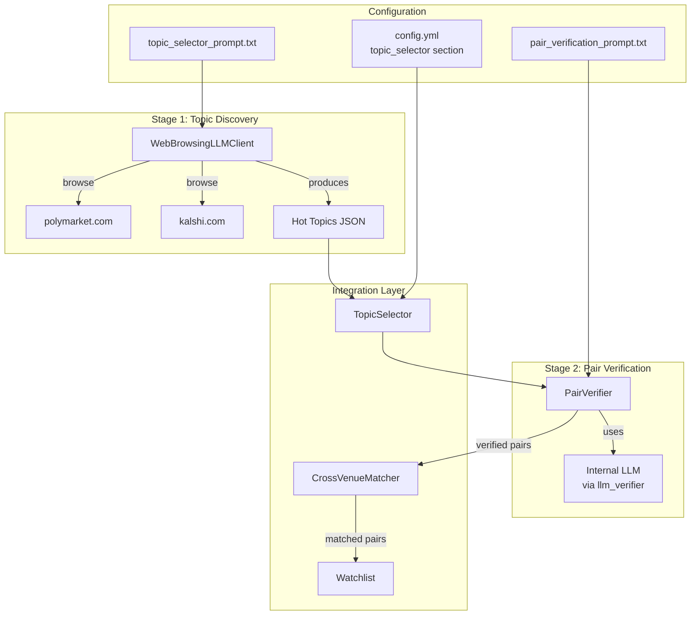

# Design Document: Daily Category Selector

## Overview

The Daily Category Selector is a two-stage LLM-powered system that intelligently identifies hot topics across Polymarket and Kalshi prediction markets to maximize arbitrage discovery potential.

**Stage 1 (External LLM):** Uses Gemini with Google Search grounding to browse polymarket.com and kalshi.com, identifying trending topics that exist on both platforms. This stage produces specific topic keywords with observed market titles.

**Stage 2 (Internal LLM):** Uses the existing `llm_verifier` infrastructure to verify that candidate market pairs are truly equivalent for arbitrage purposes. This stage understands arbitrage goals and reasons about market equivalence, settlement rules, and resolution criteria.

The system integrates with the existing `CrossVenueMatcher` by providing hot topic keywords that prioritize which market pairs to verify, improving both efficiency and accuracy of cross-venue matching.

## Architecture



### Data Flow

1. **Daily Trigger**: `TopicSelector` executes at configurable time (default 00:00 UTC) or via CLI
2. **Stage 1 - Topic Discovery**: 
   - `WebBrowsingLLMClient` calls Gemini with Google Search grounding
   - LLM browses polymarket.com and kalshi.com
   - Returns `SelectionOutput` with hot topics and observed market titles
3. **Stage 2 - Pair Verification**:
   - For each hot topic, `PairVerifier` verifies market equivalence
   - Uses existing `llm_verifier` infrastructure for LLM calls
   - Returns `PairVerificationOutput` with match status and arbitrage assessment
4. **Integration**:
   - Verified pairs are passed to `CrossVenueMatcher` as seed data
   - Matcher prioritizes these pairs for semantic matching
   - Verified pairs proceed to watchlist for monitoring

## Components and Interfaces

### TopicSelector (Orchestrator)

**File:** `src/predarb/topic_selector.py`

```python
from dataclasses import dataclass
from datetime import datetime
from typing import List, Optional
from pathlib import Path

@dataclass
class HotTopic:
    """A trending topic identified on both platforms."""
    keyword: str
    confidence: float
    polymarket_title: str
    kalshi_title: str

@dataclass
class SelectionOutput:
    """Output from Stage 1 topic discovery."""
    date: str  # ISO 8601 format
    hot_topics: List[HotTopic]
    reasoning: List[str]
    polymarket_observed: List[str]
    kalshi_observed: List[str]
    is_fallback: bool = False
    fallback_reason: Optional[str] = None

@dataclass
class VerifiedPair:
    """A verified market pair from Stage 2."""
    keyword: str
    polymarket_title: str
    kalshi_title: str
    is_match: bool
    confidence: float
    match_reasoning: str
    arbitrage_potential: dict

class TopicSelector:
    """
    Orchestrates two-stage LLM process for daily category selection.
    
    Stage 1: Web browsing LLM discovers hot topics
    Stage 2: Internal LLM verifies market pair equivalence
    """
    
    def __init__(self, config: TopicSelectorConfig):
        self.config = config
        self.web_llm = WebBrowsingLLMClient(config.llm)
        self.pair_verifier = PairVerifier(config.verification)
        self._cache: Optional[SelectionOutput] = None
    
    def select(self, force_refresh: bool = False) -> SelectionOutput:
        """
        Execute daily category selection.
        
        Returns cached result if available for today unless force_refresh=True.
        """
        pass
    
    def get_verified_pairs(self) -> List[VerifiedPair]:
        """
        Get verified market pairs from Stage 2.
        
        Must call select() first.
        """
        pass
    
    def _load_cache(self) -> Optional[SelectionOutput]:
        """Load cached selection from disk."""
        pass
    
    def _save_cache(self, output: SelectionOutput) -> None:
        """Persist selection to disk."""
        pass
    
    def _is_cache_valid(self) -> bool:
        """Check if cached selection is for today."""
        pass
```

### WebBrowsingLLMClient (Stage 1)

**File:** `src/predarb/web_browsing_llm.py`

```python
from abc import ABC, abstractmethod
from typing import Optional
import logging

logger = logging.getLogger(__name__)

class WebBrowsingLLMProvider(ABC):
    """Abstract base for web-browsing LLM providers."""
    
    @abstractmethod
    def browse_and_analyze(self, prompt: str) -> dict:
        """
        Send prompt with web browsing capability.
        
        Returns parsed JSON response or empty dict on failure.
        """
        pass

class GeminiWebBrowsingProvider(WebBrowsingLLMProvider):
    """
    Gemini provider with Google Search grounding.
    
    Uses Gemini 1.5 Pro with grounding enabled to browse
    polymarket.com and kalshi.com for trending markets.
    """
    
    def __init__(
        self,
        api_key: Optional[str] = None,
        model: str = "gemini-1.5-pro",
        timeout_s: float = 60.0,
    ):
        self.api_key = api_key or os.getenv("GEMINI_API_KEY", "")
        self.model = model
        self.timeout_s = timeout_s
    
    def browse_and_analyze(self, prompt: str) -> dict:
        """
        Call Gemini with Google Search grounding enabled.
        
        The grounding feature allows Gemini to search the web
        and access current information from polymarket.com and kalshi.com.
        """
        pass

class PerplexityProvider(WebBrowsingLLMProvider):
    """
    Perplexity provider for web-enabled LLM queries.
    
    Alternative to Gemini for web browsing capability.
    """
    
    def __init__(
        self,
        api_key: Optional[str] = None,
        model: str = "llama-3.1-sonar-large-128k-online",
        timeout_s: float = 60.0,
    ):
        self.api_key = api_key or os.getenv("PERPLEXITY_API_KEY", "")
        self.model = model
        self.timeout_s = timeout_s
    
    def browse_and_analyze(self, prompt: str) -> dict:
        """Call Perplexity with online search enabled."""
        pass

class WebBrowsingLLMClient:
    """
    Client for Stage 1 topic discovery using web-browsing LLM.
    
    Supports multiple providers: Gemini (primary), Perplexity (alternative).
    """
    
    def __init__(self, config: WebBrowsingLLMConfig):
        self.config = config
        self.provider = self._create_provider()
        self.prompt_template = self._load_prompt_template()
    
    def discover_topics(self) -> SelectionOutput:
        """
        Discover hot topics by browsing prediction market websites.
        
        Returns SelectionOutput with hot_topics, reasoning, and observed markets.
        Implements retry with exponential backoff on failure.
        """
        pass
    
    def _create_provider(self) -> WebBrowsingLLMProvider:
        """Create provider based on configuration."""
        pass
    
    def _load_prompt_template(self) -> str:
        """Load prompt template from data/topic_selector_prompt.txt."""
        pass
    
    def _validate_response(self, response: dict) -> bool:
        """Validate response matches expected schema."""
        pass
    
    def _parse_response(self, response: dict) -> SelectionOutput:
        """Parse validated response into SelectionOutput."""
        pass
```

### PairVerifier (Stage 2)

**File:** `src/predarb/pair_verifier.py`

```python
from typing import List, Optional
from predarb.llm_verifier import LLMVerifier, LLMVerifierConfig

class PairVerificationOutput:
    """Output from Stage 2 pair verification."""
    is_match: bool
    confidence: float
    match_reasoning: str
    settlement_comparison: dict
    arbitrage_potential: dict

class PairVerifier:
    """
    Stage 2: Verify market pair equivalence using internal LLM.
    
    Leverages existing llm_verifier infrastructure for LLM calls.
    Adds arbitrage-specific context and settlement comparison.
    """
    
    def __init__(self, config: PairVerificationConfig):
        self.config = config
        self.llm_verifier = self._create_llm_verifier()
        self.prompt_template = self._load_prompt_template()
        self._cache: dict = {}
    
    def verify_pair(
        self,
        keyword: str,
        polymarket_title: str,
        kalshi_title: str,
    ) -> PairVerificationOutput:
        """
        Verify if two market titles represent equivalent events.
        
        Uses hot topic context from Stage 1 to inform verification.
        Returns detailed assessment including settlement comparison.
        """
        pass
    
    def verify_all(
        self,
        hot_topics: List[HotTopic],
    ) -> List[VerifiedPair]:
        """
        Verify all hot topics from Stage 1.
        
        Processes in order of confidence (highest first).
        Filters out pairs with confidence below threshold.
        """
        pass
    
    def _create_llm_verifier(self) -> LLMVerifier:
        """Create LLM verifier using existing infrastructure."""
        pass
    
    def _load_prompt_template(self) -> str:
        """Load prompt template from data/pair_verification_prompt.txt."""
        pass
    
    def _build_prompt(
        self,
        keyword: str,
        polymarket_title: str,
        kalshi_title: str,
    ) -> str:
        """Build verification prompt with arbitrage context."""
        pass
    
    def _cache_key(self, polymarket_title: str, kalshi_title: str) -> str:
        """Generate cache key for pair verification."""
        pass
```

### Configuration Models

**File:** `src/predarb/config.py` (additions)

```python
class WebBrowsingLLMConfig(BaseModel):
    """Configuration for web-browsing LLM (Stage 1)."""
    provider: str = "gemini"  # "gemini", "perplexity"
    model: str = "gemini-1.5-pro"
    api_key_env: str = "GEMINI_API_KEY"
    timeout_s: float = 60.0
    max_retries: int = 3

class PairVerificationConfig(BaseModel):
    """Configuration for pair verification (Stage 2)."""
    min_confidence: float = 0.7
    use_existing_verifier: bool = True  # Use llm_verifier infrastructure
    cache_results: bool = True

class TopicSelectorConfig(BaseModel):
    """Configuration for daily category selector."""
    enabled: bool = False
    execution_time_utc: str = "00:00"  # Daily execution time
    output_path: str = "data/daily_category_selection.json"
    usage_stats_path: str = "data/category_selector_usage.json"
    prompt_path: str = "data/topic_selector_prompt.txt"
    verification_prompt_path: str = "data/pair_verification_prompt.txt"
    max_hot_topics: int = 10
    default_fallback_category: str = "Politics"
    excluded_categories: List[str] = ["Sports"]
    
    # Stage 1 config
    llm: WebBrowsingLLMConfig = Field(default_factory=WebBrowsingLLMConfig)
    
    # Stage 2 config
    verification: PairVerificationConfig = Field(default_factory=PairVerificationConfig)
    
    # Target URLs
    polymarket_url: str = "polymarket.com"
    kalshi_url: str = "kalshi.com"
```

### CLI Integration

**File:** `src/predarb/cli.py` (additions)

```python
@app.command()
def select_category(
    config: str = typer.Option("config.yml", help="Config file path"),
    force_refresh: bool = typer.Option(False, help="Force refresh even if cached"),
):
    """
    Run daily category selection.
    
    Executes two-stage LLM process to identify hot topics
    and verify market pair equivalence.
    """
    pass
```

## Data Models

### SelectionOutput Schema

```json
{
  "date": "2024-01-15",
  "hot_topics": [
    {
      "keyword": "Bitcoin $100k",
      "confidence": 0.92,
      "polymarket_title": "Will Bitcoin reach $100,000 by end of 2024?",
      "kalshi_title": "Bitcoin above $100,000 on December 31?"
    }
  ],
  "reasoning": [
    "Bitcoin price markets are trending on both platforms",
    "High volume and featured placement observed",
    "Clear binary outcome with upcoming resolution"
  ],
  "polymarket_observed": ["Bitcoin $100k", "Trump 2024", "Fed Rate March"],
  "kalshi_observed": ["Bitcoin $100k", "Trump Win", "Fed Rate Cut"],
  "is_fallback": false,
  "fallback_reason": null
}
```

### PairVerificationOutput Schema

```json
{
  "is_match": true,
  "confidence": 0.88,
  "match_reasoning": "Both markets resolve on Bitcoin price reaching $100,000 by end of 2024",
  "settlement_comparison": {
    "polymarket_resolution": "Resolves YES if Bitcoin price >= $100,000 on any major exchange by Dec 31, 2024",
    "kalshi_resolution": "Resolves YES if Bitcoin price >= $100,000 on CoinGecko at 11:59 PM ET Dec 31, 2024",
    "are_compatible": true,
    "compatibility_notes": "Minor difference in price source (any exchange vs CoinGecko) but likely to resolve same way"
  },
  "arbitrage_potential": {
    "price_difference_likely": true,
    "why_prices_might_differ": "Different user bases and liquidity profiles between platforms",
    "risk_factors": ["Price source difference could cause divergent resolution in edge cases"]
  }
}
```

### Configuration YAML Structure

```yaml
# config.yml additions
topic_selector:
  enabled: true
  execution_time_utc: "00:00"
  output_path: "data/daily_category_selection.json"
  usage_stats_path: "data/category_selector_usage.json"
  prompt_path: "data/topic_selector_prompt.txt"
  verification_prompt_path: "data/pair_verification_prompt.txt"
  max_hot_topics: 10
  default_fallback_category: "Politics"
  excluded_categories:
    - "Sports"
  
  llm:
    provider: "gemini"
    model: "gemini-1.5-pro"
    api_key_env: "GEMINI_API_KEY"
    timeout_s: 60.0
    max_retries: 3
  
  verification:
    min_confidence: 0.7
    use_existing_verifier: true
    cache_results: true
  
  polymarket_url: "polymarket.com"
  kalshi_url: "kalshi.com"
```


## Correctness Properties

*A property is a characteristic or behavior that should hold true across all valid executions of a system—essentially, a formal statement about what the system should do. Properties serve as the bridge between human-readable specifications and machine-verifiable correctness guarantees.*

### Property 1: SelectionOutput Persistence Round-Trip

*For any* valid `SelectionOutput`, serializing it to JSON and writing to the configured output path, then reading and deserializing, should produce an equivalent `SelectionOutput` with identical field values.

**Validates: Requirements 1.3**

### Property 2: Cache Idempotency

*For any* date with an existing cached `SelectionOutput`, calling `select()` multiple times without `force_refresh=True` should return the same cached result without invoking the Web_Browsing_LLM.

**Validates: Requirements 1.4, 12.1, 12.2**

### Property 3: SelectionOutput Schema Validation

*For any* `SelectionOutput` produced by the system (whether from LLM or fallback), it must contain:
- `date` as ISO 8601 string (YYYY-MM-DD)
- `hot_topics` as array of objects with keyword, confidence, polymarket_title, kalshi_title
- `confidence` values in [0.0, 1.0] range
- `reasoning` as array of 3-5 strings
- `polymarket_observed` and `kalshi_observed` as string arrays

**Validates: Requirements 9.1, 9.2, 9.3, 9.4, 9.5, 9.6, 9.7**

### Property 4: Hot Topics Overlap Invariant

*For any* `SelectionOutput` with non-empty `hot_topics`, each hot topic's `keyword` must appear in both `polymarket_observed` and `kalshi_observed` arrays (case-insensitive matching).

**Validates: Requirements 5.1, 5.2**

### Property 5: Hot Topics Confidence Ordering

*For any* `SelectionOutput` with multiple `hot_topics`, the topics must be sorted by `confidence` in descending order.

**Validates: Requirements 5.3**

### Property 6: Category Exclusion Invariant

*For any* `SelectionOutput`, no `hot_topic.keyword` should match any category in the configured `excluded_categories` list (default: ["Sports"]).

**Validates: Requirements 11.1, 11.2, 11.3, 11.4**

### Property 7: Fallback Behavior on Failure

*For any* LLM failure (timeout, API error, or invalid response) after all retries are exhausted, the returned `SelectionOutput` must have:
- `is_fallback = true`
- `fallback_reason` as non-empty string
- `confidence = 0.0` for all hot_topics (or empty hot_topics)

**Validates: Requirements 2.4, 13.1, 13.3**

### Property 8: Retry with Exponential Backoff

*For any* transient LLM failure, the system should retry up to `max_retries` times (default: 3) with exponential backoff delays before falling back.

**Validates: Requirements 12.4, 17.8**

### Property 9: PairVerificationOutput Schema Validation

*For any* `PairVerificationOutput` produced by Stage 2 verification, it must contain:
- `is_match` as boolean
- `confidence` as float in [0.0, 1.0]
- `match_reasoning` as non-empty string
- `settlement_comparison` object with polymarket_resolution, kalshi_resolution, are_compatible, compatibility_notes
- `arbitrage_potential` object with price_difference_likely, why_prices_might_differ, risk_factors

**Validates: Requirements 15.6, 15.7, 15.8, 17.1, 17.2, 17.3, 17.4, 17.5, 17.6, 17.7**

### Property 10: Low Confidence Pair Exclusion

*For any* market pair where Stage 2 verification returns `confidence < min_confidence` (default: 0.7), the pair must be excluded from the final verified pairs list or marked as `is_match = false`.

**Validates: Requirements 15.9**

### Property 11: Pair Processing Order

*For any* list of hot topics from Stage 1, Stage 2 verification must process them in order of Stage 1 confidence score (highest first).

**Validates: Requirements 15.10**

### Property 12: Pair Verification Caching

*For any* market pair (polymarket_title, kalshi_title), calling `verify_pair()` multiple times should return the cached result without invoking the Internal_LLM after the first call.

**Validates: Requirements 17.9**

## Error Handling

### Stage 1 (Web Browsing LLM) Errors

| Error Type | Handling Strategy |
|------------|-------------------|
| API Timeout | Retry with exponential backoff (1s, 2s, 4s), then fallback |
| Rate Limit | Wait for rate limit reset, retry once, then fallback |
| Invalid JSON Response | Log validation error, retry with clarifying prompt, then fallback |
| Network Error | Retry with exponential backoff, then fallback |
| Empty Response | Treat as invalid, retry, then fallback |

### Stage 2 (Internal LLM) Errors

| Error Type | Handling Strategy |
|------------|-------------------|
| API Timeout | Use existing `llm_verifier` timeout handling (fail_open or fail_closed) |
| Parse Error | Log error, mark pair as unverified, continue with next pair |
| Rate Limit | Respect rate limits, queue remaining pairs for later |

### Fallback Cascade

```
1. Try Web_Browsing_LLM (Stage 1)
   ↓ failure
2. Retry up to max_retries with exponential backoff
   ↓ all retries exhausted
3. Load previous day's SelectionOutput from cache
   ↓ no previous cache
4. Return default fallback with configured default_fallback_category
```

### Error Logging

All errors are logged with structured context:
- Error type (timeout, api_error, parse_error, rate_limit)
- Timestamp
- Request details (prompt hash, not full prompt for privacy)
- Response snippet (first 500 chars)

Errors are written to:
- Application log (`log/topic_selector.log`)
- Usage stats file (`data/category_selector_usage.json`)

### Telegram Notifications

When fallback is triggered, send notification if Telegram is configured:
```
⚠️ Category Selector Fallback
Reason: {fallback_reason}
Using: {fallback_category}
Date: {date}
```

## Testing Strategy

### Dual Testing Approach

This feature requires both unit tests and property-based tests for comprehensive coverage:

- **Unit tests**: Verify specific examples, edge cases, integration points
- **Property tests**: Verify universal properties across generated inputs

### Property-Based Testing Configuration

- **Library**: `hypothesis` (Python property-based testing)
- **Minimum iterations**: 100 per property test
- **Tag format**: `Feature: daily-category-selector, Property {N}: {property_text}`

### Unit Tests

| Test | Description | Validates |
|------|-------------|-----------|
| `test_gemini_provider_initialization` | Verify Gemini provider creates correctly with config | Req 2.1 |
| `test_perplexity_provider_initialization` | Verify Perplexity provider creates correctly | Req 2.5 |
| `test_cli_select_category_command` | Verify CLI command exists and runs | Req 1.5 |
| `test_default_config_values` | Verify sensible defaults are applied | Req 10.5 |
| `test_prompt_template_loading` | Verify prompt loads from file | Req 8.1 |
| `test_no_overlap_fallback` | Verify fallback when no overlapping categories | Req 5.5, 11.5 |
| `test_no_previous_cache_fallback` | Verify default category used when no cache | Req 13.2 |

### Property Tests

| Test | Property | Iterations |
|------|----------|------------|
| `test_selection_output_round_trip` | Property 1 | 100 |
| `test_cache_idempotency` | Property 2 | 100 |
| `test_selection_output_schema` | Property 3 | 100 |
| `test_hot_topics_overlap` | Property 4 | 100 |
| `test_hot_topics_ordering` | Property 5 | 100 |
| `test_category_exclusion` | Property 6 | 100 |
| `test_fallback_on_failure` | Property 7 | 100 |
| `test_retry_behavior` | Property 8 | 50 |
| `test_pair_verification_schema` | Property 9 | 100 |
| `test_low_confidence_exclusion` | Property 10 | 100 |
| `test_pair_processing_order` | Property 11 | 100 |
| `test_pair_verification_caching` | Property 12 | 100 |

### Test Data Generators

```python
from hypothesis import strategies as st

# Generate valid SelectionOutput
selection_output_strategy = st.fixed_dictionaries({
    "date": st.dates().map(lambda d: d.isoformat()),
    "hot_topics": st.lists(
        st.fixed_dictionaries({
            "keyword": st.text(min_size=1, max_size=50),
            "confidence": st.floats(min_value=0.0, max_value=1.0),
            "polymarket_title": st.text(min_size=1, max_size=200),
            "kalshi_title": st.text(min_size=1, max_size=200),
        }),
        min_size=0,
        max_size=10,
    ),
    "reasoning": st.lists(st.text(min_size=1, max_size=100), min_size=3, max_size=5),
    "polymarket_observed": st.lists(st.text(min_size=1, max_size=50)),
    "kalshi_observed": st.lists(st.text(min_size=1, max_size=50)),
})

# Generate valid PairVerificationOutput
pair_verification_strategy = st.fixed_dictionaries({
    "is_match": st.booleans(),
    "confidence": st.floats(min_value=0.0, max_value=1.0),
    "match_reasoning": st.text(min_size=1, max_size=500),
    "settlement_comparison": st.fixed_dictionaries({
        "polymarket_resolution": st.text(min_size=1),
        "kalshi_resolution": st.text(min_size=1),
        "are_compatible": st.booleans(),
        "compatibility_notes": st.text(),
    }),
    "arbitrage_potential": st.fixed_dictionaries({
        "price_difference_likely": st.booleans(),
        "why_prices_might_differ": st.text(),
        "risk_factors": st.lists(st.text(), max_size=5),
    }),
})
```

### Mock Providers for Testing

```python
class MockWebBrowsingProvider(WebBrowsingLLMProvider):
    """Mock provider for deterministic testing without network."""
    
    def __init__(self, responses: List[dict] = None, fail_after: int = None):
        self.responses = responses or []
        self.fail_after = fail_after
        self.call_count = 0
    
    def browse_and_analyze(self, prompt: str) -> dict:
        self.call_count += 1
        if self.fail_after and self.call_count > self.fail_after:
            raise TimeoutError("Simulated timeout")
        if self.responses:
            return self.responses[min(self.call_count - 1, len(self.responses) - 1)]
        return self._default_response()
```

### Integration Tests

| Test | Description |
|------|-------------|
| `test_full_pipeline_with_mock_llm` | End-to-end test with mock providers |
| `test_cross_venue_matcher_integration` | Verify verified pairs integrate with matcher |
| `test_watchlist_integration` | Verify verified pairs appear in watchlist |
| `test_config_loading_integration` | Verify config loads and applies correctly |
