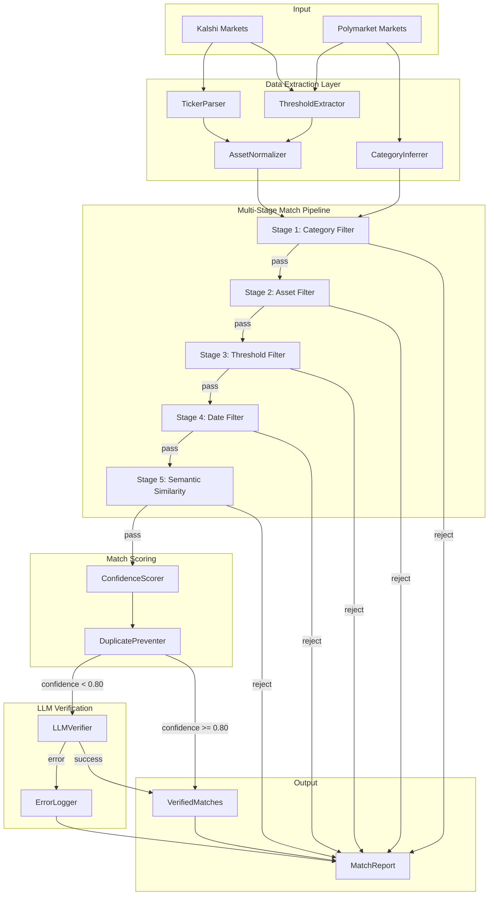

# Design Document: Improve Market Matching

## Overview

This design enhances the cross-venue market matching system to reduce false positives and improve match quality between Kalshi and Polymarket markets. The current implementation relies heavily on semantic similarity (Sentence-BERT embeddings) with basic category filtering, leading to incorrect matches when markets have similar wording but different thresholds, dates, or assets.

The improved system introduces a multi-stage matching pipeline that:
1. Extracts structured data from market questions and Kalshi tickers (asset, threshold, direction, date)
2. Applies progressive filtering stages with rejection logging
3. Computes confidence scores based on structural vs semantic matching
4. Prevents duplicate matches and produces detailed reports

Key improvements:
- **Kalshi Ticker Parser**: Extracts asset, date, threshold, direction from structured tickers like `KXETH-26JAN2310-B3730`
- **Enhanced Threshold Extraction**: Handles varied price phrasings ($3,730, 3.73k, "at least $3730")
- **Asset Normalization**: Maps aliases (ETH/Ethereum/Ether → ethereum)
- **Structural Match Filtering**: Requires matching thresholds within 0.1% before semantic comparison
- **Multi-Stage Pipeline**: Category → Asset → Threshold → Date → Semantic with rejection tracking
- **LLM Error Logging**: Clear error logging when LLM verification fails due to token limits or API errors

## Architecture



## Components and Interfaces

### 1. TickerParser

Extracts structured data from Kalshi ticker formats.

```python
@dataclass
class ParsedTicker:
    asset: str              # e.g., "eth", "btc"
    expiry: datetime        # e.g., 2023-01-26 10:00 UTC
    threshold: float        # e.g., 3730.0
    direction: str          # "above" or "below"
    raw_ticker: str         # original ticker string

class TickerParser:
    # Known ticker patterns
    PATTERNS = {
        "crypto_price": r"KX(?P<asset>[A-Z]+)-(?P<date>\d{2}[A-Z]{3}\d{2})(?P<hour>\d{2})-(?P<dir>[BT])(?P<threshold>\d+)",
        # B = Below threshold for YES, T = Above threshold for YES
    }
    
    def parse(self, ticker: str) -> Optional[ParsedTicker]:
        """Parse Kalshi ticker into structured components."""
        
    def format_ticker(self, parsed: ParsedTicker) -> str:
        """Format ParsedTicker back to ticker string (for round-trip testing)."""
```

### 2. ThresholdExtractor

Enhanced extraction of price/value thresholds from market questions.

```python
@dataclass
class ExtractedThreshold:
    value: float            # numeric value (e.g., 3730.0)
    direction: str          # "above", "below", "at_least", "at_most"
    unit: Optional[str]     # "usd", "percent", None
    raw_match: str          # original matched text

class ThresholdExtractor:
    # Patterns for various threshold phrasings
    PATTERNS = [
        r"(?P<dir>above|over|at\s+least|higher\s+than)\s*\$?(?P<num>[0-9,.]+(?:k|m)?)",
        r"(?P<dir>below|under|at\s+most|lower\s+than)\s*\$?(?P<num>[0-9,.]+(?:k|m)?)",
        r"\$(?P<num>[0-9,.]+(?:k|m)?)\s+(?P<dir>or\s+higher|or\s+more|or\s+above)",
        r"\$(?P<num>[0-9,.]+(?:k|m)?)\s+(?P<dir>or\s+lower|or\s+less|or\s+below)",
        r"(?P<num>[0-9,.]+)\s*(?P<unit>%|percent)",
    ]
    
    def extract(self, text: str) -> Optional[ExtractedThreshold]:
        """Extract threshold from market question text."""
        
    def thresholds_match(self, t1: ExtractedThreshold, t2: ExtractedThreshold, 
                         tolerance: float = 0.001) -> bool:
        """Check if two thresholds match within tolerance (0.1% default)."""
```

### 3. AssetNormalizer

Maps asset aliases to canonical names.

```python
class AssetNormalizer:
    ALIASES = {
        "ethereum": ["eth", "ethereum", "ether"],
        "bitcoin": ["btc", "bitcoin"],
        "sp500": ["s&p 500", "spx", "sp500", "s&p500", "s&p"],
        "gold": ["gold", "xau", "gld"],
        "oil": ["oil", "wti", "crude", "brent"],
        # ... extensible
    }
    
    def __init__(self, custom_aliases: Optional[Dict[str, List[str]]] = None):
        """Initialize with optional custom alias mappings."""
        
    def normalize(self, asset: str) -> str:
        """Normalize asset name to canonical form."""
        
    def assets_match(self, a1: str, a2: str) -> bool:
        """Check if two asset names refer to the same asset."""
```

### 4. CategoryInferrer

Infers category from market question when tags are empty.

```python
class CategoryInferrer:
    KEYWORD_CATEGORIES = {
        "CRYPTO": ["bitcoin", "ethereum", "btc", "eth", "crypto", "token", "defi", "nft"],
        "POLITICS": ["president", "election", "congress", "senate", "vote", "trump", "biden", "republican", "democrat"],
        "ECONOMICS": ["fed", "inflation", "cpi", "interest rate", "gdp", "unemployment", "fomc", "treasury"],
        "SPORTS": ["nfl", "nba", "mlb", "nhl", "super bowl", "championship", "playoffs"],
    }
    
    def infer(self, market: Market) -> str:
        """Infer category from market question and description."""
```

### 5. MatchPipeline

Multi-stage filtering pipeline with rejection tracking.

```python
@dataclass
class PipelineStage:
    name: str
    filter_fn: Callable[[Market, Market], bool]
    rejection_reason_fn: Callable[[Market, Market], str]

@dataclass
class RejectionRecord:
    kalshi_id: str
    polymarket_id: str
    stage: str
    reason: str

@dataclass
class MatchCandidate:
    kalshi_market: Market
    polymarket_market: Market
    structural_matches: Dict[str, bool]  # {"asset": True, "threshold": True, ...}
    semantic_score: float
    confidence: float

class MatchPipeline:
    def __init__(self, 
                 ticker_parser: TickerParser,
                 threshold_extractor: ThresholdExtractor,
                 asset_normalizer: AssetNormalizer,
                 category_inferrer: CategoryInferrer):
        self.stages: List[PipelineStage] = self._build_stages()
        self.rejections: List[RejectionRecord] = []
        self.stage_counts: Dict[str, int] = {}
        
    def _build_stages(self) -> List[PipelineStage]:
        """Build the 5-stage pipeline."""
        
    def process(self, kalshi_markets: List[Market], 
                poly_markets: List[Market]) -> List[MatchCandidate]:
        """Run all candidates through the pipeline."""
        
    def get_rejection_summary(self) -> Dict[str, int]:
        """Get rejection counts per stage."""
```

### 6. ConfidenceScorer

Computes match confidence based on structural vs semantic matching.

```python
class ConfidenceScorer:
    STRUCTURAL_WEIGHTS = {
        "asset": 0.25,
        "threshold": 0.30,
        "direction": 0.15,
        "date": 0.20,
        "category": 0.10,
    }
    
    def score(self, candidate: MatchCandidate) -> float:
        """Compute confidence score (0.0-1.0)."""
        # Full structural match: >= 0.95
        # Semantic only: semantic_score * 0.7
        
    def needs_llm_verification(self, confidence: float) -> bool:
        """Check if match needs LLM verification (confidence < 0.80)."""
```

### 7. DuplicatePreventer

Ensures one-to-one matching between venues.

```python
class DuplicatePreventer:
    def __init__(self):
        self.matched_polymarket_ids: Set[str] = set()
        self.duplicate_log: List[Dict] = []
        
    def select_best_match(self, candidates: List[MatchCandidate], 
                          polymarket_id: str) -> Optional[MatchCandidate]:
        """Select highest confidence match, preferring higher liquidity on ties."""
        
    def deduplicate(self, candidates: List[MatchCandidate]) -> List[MatchCandidate]:
        """Remove duplicate matches, keeping best for each Polymarket market."""
```

### 8. MatchReporter

Generates detailed match reports.

```python
@dataclass
class MatchReport:
    timestamp: datetime
    total_candidates: int
    matches_accepted: int
    rejections_by_stage: Dict[str, int]
    accepted_matches: List[Dict]  # {kalshi_id, poly_id, confidence, matched_fields, semantic_score}
    rejected_matches: List[Dict]  # {kalshi_id, poly_id, stage, reason}
    llm_errors: List[Dict]        # {kalshi_id, poly_id, error_type, error_message}

class MatchReporter:
    def __init__(self, output_dir: str = "reports"):
        self.output_dir = Path(output_dir)
        
    def generate(self, pipeline: MatchPipeline, 
                 verified_matches: List[MatchCandidate],
                 llm_errors: List[Dict]) -> MatchReport:
        """Generate comprehensive match report."""
        
    def to_json(self, report: MatchReport) -> str:
        """Serialize report to JSON."""
        
    def log_summary(self, report: MatchReport) -> None:
        """Log summary statistics at INFO level."""
```

### 9. Enhanced LLM Error Logging

Updates to LLMVerifier for better error logging.

```python
class LLMVerificationError:
    """Structured error for LLM verification failures."""
    error_type: str      # "token_limit", "api_error", "timeout", "parse_error", "rate_limit"
    error_message: str   # Detailed error message
    market_a_id: str
    market_b_id: str
    timestamp: datetime
    raw_error: Optional[str]  # Original exception message

class LLMVerifier:
    # Existing methods plus:
    
    def _log_verification_error(self, error: LLMVerificationError) -> None:
        """Log LLM verification error with full context for debugging."""
        logger.error(
            f"LLM verification failed: {error.error_type} | "
            f"Markets: {error.market_a_id} <-> {error.market_b_id} | "
            f"Message: {error.error_message}"
        )
        if error.raw_error:
            logger.debug(f"Raw error: {error.raw_error}")
```

## Data Models

### Extended Market Model

The existing `Market` model already has fields for extracted data. We'll use them:

```python
class Market(BaseModel):
    # Existing fields...
    
    # Extracted/normalized fields (already present)
    comparator: Optional[str] = None    # ">", "<", ">=", "<="
    threshold: Optional[float] = None   # numeric threshold
    asset: Optional[str] = None         # normalized asset name
    expiry: Optional[datetime] = None   # resolution date
    
    # New fields for enhanced matching
    parsed_ticker: Optional[ParsedTicker] = None  # Kalshi ticker data
    inferred_category: Optional[str] = None       # Category when tags empty
    threshold_unit: Optional[str] = None          # "usd", "percent"
```

### VerifiedMatch Model

```python
@dataclass
class VerifiedMatch:
    kalshi_market: Market
    polymarket_market: Market
    confidence: float
    semantic_score: float
    structural_matches: Dict[str, bool]
    matched_fields: List[str]           # ["asset", "threshold", "direction", "date"]
    llm_verified: bool
    llm_confidence: Optional[float]
```

### MatchReport Schema

```python
@dataclass
class MatchReport:
    timestamp: datetime
    run_id: str
    
    # Summary stats
    total_kalshi_markets: int
    total_polymarket_markets: int
    total_candidates_considered: int
    matches_accepted: int
    
    # Rejection breakdown
    rejections_by_stage: Dict[str, int]
    # {"category": 150, "asset": 45, "threshold": 23, "date": 12, "semantic": 8}
    
    # Detailed results
    accepted_matches: List[VerifiedMatch]
    rejected_matches: List[RejectionRecord]
    
    # LLM errors (per user feedback)
    llm_errors: List[LLMVerificationError]
    
    # Duplicate handling
    duplicates_detected: int
    duplicates_resolved: List[Dict]  # {poly_id, selected_kalshi_id, rejected_kalshi_ids}
```


## Correctness Properties

*A property is a characteristic or behavior that should hold true across all valid executions of a system—essentially, a formal statement about what the system should do. Properties serve as the bridge between human-readable specifications and machine-verifiable correctness guarantees.*

### Property 1: Ticker Parsing Round-Trip

*For any* valid Kalshi ticker string, parsing it into a `ParsedTicker` and then formatting it back to a ticker string should produce an equivalent ticker (same asset, date, threshold, direction).

**Validates: Requirements 1.5**

### Property 2: Invalid Ticker Returns None

*For any* string that does not match known Kalshi ticker patterns, the `TickerParser.parse()` method should return `None` without raising an exception.

**Validates: Requirements 1.4**

### Property 3: Threshold Extraction Completeness

*For any* market question text containing a price threshold with a recognizable pattern (dollar amounts, percentages, "above/below" phrasings), the `ThresholdExtractor.extract()` method should return an `ExtractedThreshold` with the correct numeric value and direction.

**Validates: Requirements 2.1**

### Property 4: Missing Threshold Returns None

*For any* text string that does not contain a recognizable threshold pattern, the `ThresholdExtractor.extract()` method should return `None` without raising an exception.

**Validates: Requirements 2.5**

### Property 5: Percentage Threshold Handling

*For any* market question containing a percentage threshold (e.g., "above 5%", "at least 3.5%"), the `ThresholdExtractor.extract()` method should return an `ExtractedThreshold` with the numeric value and `unit="percent"`.

**Validates: Requirements 2.6**

### Property 6: Asset Normalization Case-Insensitivity

*For any* asset name string and any case variation of that string (uppercase, lowercase, mixed), the `AssetNormalizer.normalize()` method should return the same canonical name.

**Validates: Requirements 3.6**

### Property 7: Unknown Asset Fallback

*For any* asset name string that is not in the alias mapping, the `AssetNormalizer.normalize()` method should return the lowercase, whitespace-trimmed version of the input.

**Validates: Requirements 3.5**

### Property 8: Threshold Tolerance Filtering

*For any* pair of markets where both have extracted thresholds, the `MatchPipeline` should only accept them as a match candidate if the thresholds are within 0.1% of each other. Markets with thresholds differing by more than 0.1% should be rejected at the threshold filter stage.

**Validates: Requirements 4.1**

### Property 9: Asset Match Requirement

*For any* pair of markets where both have extracted and normalized assets, the `MatchPipeline` should only accept them as a match candidate if the normalized assets are identical.

**Validates: Requirements 4.2**

### Property 10: Direction Match Requirement

*For any* pair of markets where both have extracted directions (above/below), the `MatchPipeline` should only accept them as a match candidate if the directions match.

**Validates: Requirements 4.3**

### Property 11: Elevated Semantic Threshold for Missing Structural Data

*For any* pair of markets where structural data (asset, threshold, direction) is missing from one or both markets, the `MatchPipeline` should require semantic similarity >= 0.85 for acceptance (instead of the standard 0.60).

**Validates: Requirements 4.5, 7.5**

### Property 12: Date Tolerance Filtering

*For any* pair of markets where both have expiry dates, the `MatchPipeline` should only accept them as a match candidate if the dates are within 2 hours of each other.

**Validates: Requirements 5.1**

### Property 13: Missing Date Exclusion

*For any* pair of markets where date information is missing from either market, the `MatchPipeline` should exclude the pair from matching and log a warning.

**Validates: Requirements 5.4**

### Property 14: Timezone Normalization

*For any* pair of market dates expressed in different timezones, the `MatchPipeline` should normalize both to UTC before comparison, ensuring that equivalent moments in time are recognized as matching regardless of timezone representation.

**Validates: Requirements 5.5**

### Property 15: Category Inference for Empty Tags

*For any* Polymarket market with empty tags and null category, the `CategoryInferrer` should infer a category from the market question text.

**Validates: Requirements 6.1**

### Property 16: Category Keyword Recognition

*For any* market question containing keywords from a known category (CRYPTO, POLITICS, ECONOMICS), the `CategoryInferrer` should assign the corresponding category. Specifically:
- Questions containing "bitcoin", "ethereum", "btc", "eth", "crypto", "token" → CRYPTO
- Questions containing "president", "election", "congress", "senate", "vote", "trump", "biden" → POLITICS
- Questions containing "fed", "inflation", "cpi", "interest rate", "gdp", "unemployment" → ECONOMICS

**Validates: Requirements 6.2, 6.3, 6.4**

### Property 17: OTHER Category Exclusion

*For any* market assigned category "OTHER" (no category could be inferred), the market should be excluded from strict bucket matching.

**Validates: Requirements 6.5**

### Property 18: Structural Match Semantic Threshold

*For any* pair of markets that pass all structural filters (category, asset, threshold, date), the `MatchPipeline` should require semantic similarity >= 0.60 for final acceptance.

**Validates: Requirements 7.4**

### Property 19: Verified Match Contains Required Fields

*For any* `VerifiedMatch` returned by the `MatchPipeline`, it should contain: match score, matched fields list, confidence level, and both market references.

**Validates: Requirements 7.6**

### Property 20: Rejection Records Contain Stage and Reason

*For any* rejected match candidate, the rejection record should contain: both market IDs, the rejection stage name, and the rejection reason. The pipeline should also track rejection counts per stage.

**Validates: Requirements 7.2, 7.3**

### Property 21: Confidence Score Range

*For any* `VerifiedMatch`, the confidence score should be in the range [0.0, 1.0].

**Validates: Requirements 8.1**

### Property 22: Full Structural Match High Confidence

*For any* match where asset, threshold, direction, and date all match structurally, the confidence score should be >= 0.95.

**Validates: Requirements 8.2**

### Property 23: Semantic-Only Confidence Formula

*For any* match where only semantic similarity is used (no structural data available), the confidence score should equal `semantic_score * 0.7`.

**Validates: Requirements 8.3**

### Property 24: LLM Verification Flag

*For any* match with confidence score below 0.80, the match should be flagged for LLM verification.

**Validates: Requirements 8.5**

### Property 25: One-to-One Match Constraint

*For any* set of matches returned by the `MatchPipeline`, each Polymarket market should appear at most once. When multiple Kalshi markets match the same Polymarket market, only the highest-confidence match should be selected.

**Validates: Requirements 9.2, 9.5**

### Property 26: Liquidity Tie-Breaking

*For any* scenario where two Kalshi markets have equal confidence scores for the same Polymarket market, the `DuplicatePreventer` should select the Kalshi market with higher liquidity.

**Validates: Requirements 9.4**

### Property 27: Match Report Contains Required Fields

*For any* `MatchReport` generated by the `MatchReporter`, it should contain: total candidates considered, matches accepted count, and rejections per stage breakdown.

**Validates: Requirements 10.1**

### Property 28: Match Record Completeness

*For any* accepted match in the report, the record should contain: both market IDs, confidence score, matched fields, and semantic score. *For any* rejected match in the report, the record should contain: both market IDs, rejection stage, and rejection reason.

**Validates: Requirements 10.2, 10.3**

### Property 29: Report JSON Serialization

*For any* `MatchReport`, calling `to_json()` should produce a valid JSON string that can be parsed back into an equivalent data structure.

**Validates: Requirements 10.4**

## Error Handling

### LLM Verification Errors

Per user feedback, the system must provide clear error logging when LLM verification fails. The following error types should be logged with full context:

| Error Type | Cause | Logging Behavior |
|------------|-------|------------------|
| `token_limit` | Prompt exceeds model's context window | Log ERROR with market IDs, prompt length, and model limit |
| `api_error` | API returns non-200 status | Log ERROR with market IDs, status code, and response body |
| `timeout` | Request exceeds timeout threshold | Log WARNING with market IDs and timeout duration |
| `parse_error` | Response is not valid JSON | Log ERROR with market IDs and raw response text |
| `rate_limit` | API rate limit exceeded | Log WARNING with market IDs and retry-after header |

Example log format:
```
ERROR - LLM verification failed: token_limit | Markets: KXETH-26JAN2310-B3730 <-> poly_eth_3730 | Message: Prompt length 8500 exceeds model limit 4096
DEBUG - Raw error: openai.error.InvalidRequestError: This model's maximum context length is 4096 tokens...
```

### Pipeline Stage Errors

Each pipeline stage should handle errors gracefully:

1. **Extraction Errors**: If ticker parsing or threshold extraction fails, log WARNING and continue with available data
2. **Embedding Errors**: If semantic embedding fails, log ERROR and skip the market pair
3. **Date Parsing Errors**: If date parsing fails, treat as missing date (exclude from matching per Req 5.4)

### Graceful Degradation

When structural data extraction fails:
- Log the failure at DEBUG level with the raw input
- Fall back to semantic-only matching with elevated threshold (0.85)
- Include `extraction_failed: true` in the match metadata

## Testing Strategy

### Property-Based Testing

Use `hypothesis` library for property-based testing with minimum 100 iterations per property.

**Test Configuration:**
```python
from hypothesis import given, settings, strategies as st

@settings(max_examples=100)
@given(...)
def test_property_name():
    # Feature: improve-market-matching, Property N: property_text
    ...
```

**Generator Strategies:**

1. **Valid Kalshi Tickers**: Generate tickers matching the pattern `KX{ASSET}-{DATE}{HOUR}-{DIR}{THRESHOLD}`
   ```python
   @st.composite
   def valid_kalshi_ticker(draw):
       asset = draw(st.sampled_from(["ETH", "BTC", "SOL", "DOGE"]))
       day = draw(st.integers(1, 28))
       month = draw(st.sampled_from(["JAN", "FEB", "MAR", "APR", "MAY", "JUN", "JUL", "AUG", "SEP", "OCT", "NOV", "DEC"]))
       year = draw(st.integers(23, 30))
       hour = draw(st.integers(0, 23))
       direction = draw(st.sampled_from(["B", "T"]))
       threshold = draw(st.integers(100, 100000))
       return f"KX{asset}-{day:02d}{month}{year:02d}{hour:02d}-{direction}{threshold}"
   ```

2. **Market Questions with Thresholds**: Generate questions with various threshold phrasings
   ```python
   @st.composite
   def question_with_threshold(draw):
       asset = draw(st.sampled_from(["ETH", "Bitcoin", "S&P 500"]))
       threshold = draw(st.integers(100, 100000))
       phrasing = draw(st.sampled_from([
           f"Will {asset} be above ${threshold}?",
           f"{asset} price ${threshold:,} or higher?",
           f"Will {asset} close below ${threshold}?",
       ]))
       return phrasing, threshold
   ```

3. **Market Pairs**: Generate pairs of markets with controlled structural similarity
   ```python
   @st.composite
   def market_pair(draw, structural_match: bool):
       # Generate base market
       # If structural_match, generate second with same asset/threshold/date
       # Else, vary one or more fields
       ...
   ```

### Unit Tests

Unit tests for specific examples and edge cases:

1. **Ticker Parsing Examples** (Req 1.2, 1.3)
   - `KXETH-26JAN2310-B3730` → asset=ETH, date=2023-01-26 10:00, threshold=3730, direction=above
   - `KXBTC-31DEC2412-T95000` → asset=BTC, date=2024-12-31 12:00, threshold=95000, direction=above

2. **Threshold Extraction Examples** (Req 2.2, 2.3, 2.4)
   - "$3,730" → 3730
   - "3.73k" → 3730
   - "above $3730" → threshold=3730, direction=above

3. **Asset Normalization Examples** (Req 3.2, 3.3, 3.4)
   - "ETH", "Ethereum", "Ether" → "ethereum"
   - "BTC", "Bitcoin" → "bitcoin"
   - "S&P 500", "SPX" → "sp500"

4. **Edge Cases**
   - Empty string inputs
   - Unicode characters in market questions
   - Extremely large threshold values
   - Markets with identical questions but different dates

### Integration Tests

1. **Full Pipeline Test**: Run complete pipeline with synthetic market data, verify:
   - Correct number of matches
   - No duplicate Polymarket markets in results
   - All rejections have stage and reason

2. **LLM Error Handling Test**: Mock LLM provider to return various errors, verify:
   - Errors are logged with correct format
   - Pipeline continues processing other pairs
   - Error counts are tracked in report

### Test File Organization

```
tests/
├── test_ticker_parser.py           # Properties 1-2, examples 1.2-1.3
├── test_threshold_extractor.py     # Properties 3-5, examples 2.2-2.4
├── test_asset_normalizer.py        # Properties 6-7, examples 3.2-3.4
├── test_category_inferrer.py       # Properties 15-17
├── test_match_pipeline.py          # Properties 8-14, 18-20
├── test_confidence_scorer.py       # Properties 21-24
├── test_duplicate_preventer.py     # Properties 25-26
├── test_match_reporter.py          # Properties 27-29
└── test_matching_integration.py    # End-to-end pipeline tests
```
